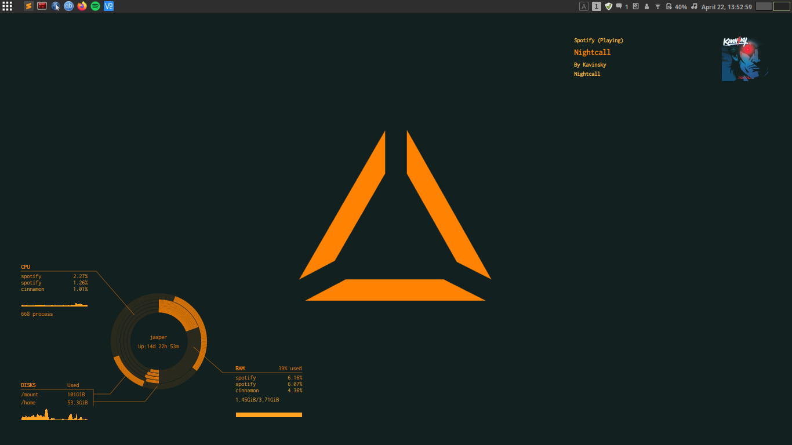

# conky-orange-rings
An orange variation on [conky_grey](https://www.gnome-look.org/content/show.php/conky_grey?content=137272 "conky_grey - Gnome-look.org"). It uses the base files, and the layout etc. has been modified. 

## Installation
* Clone or Download the zip from GitHub
* Copy the `conkyrc_orange_rings` and `conky_orange_rings.lua` files to your conky directory e.g. `~/.conky/`
* Use `conkystartup.sh` script if you want to add it to your Startup Applications, or use the command in this script to start an instance manually.

## Example

## To Do
This is a first draft. 

Some improvements I wish to make;
* Make it more flexible in terms of configuration, e.g. dynamically changing positioning of text etc. based on ring radius 
* Other layout options